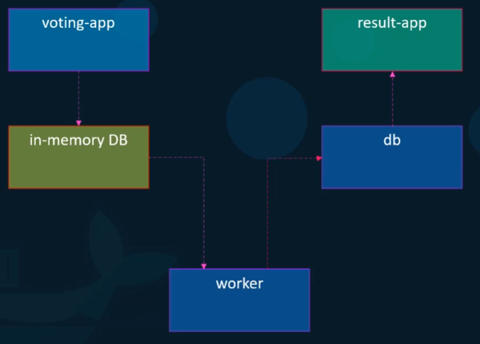
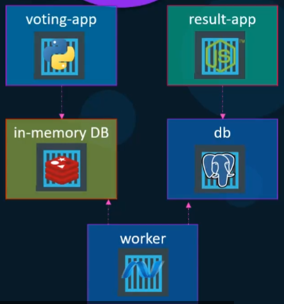
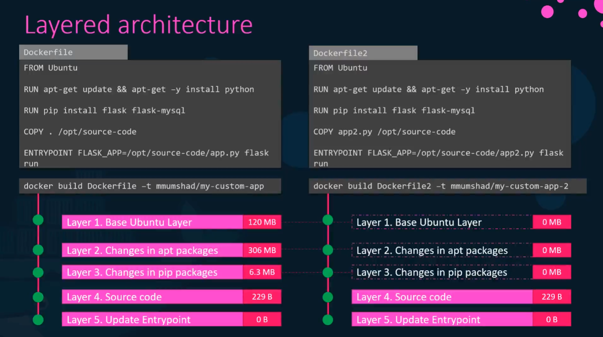
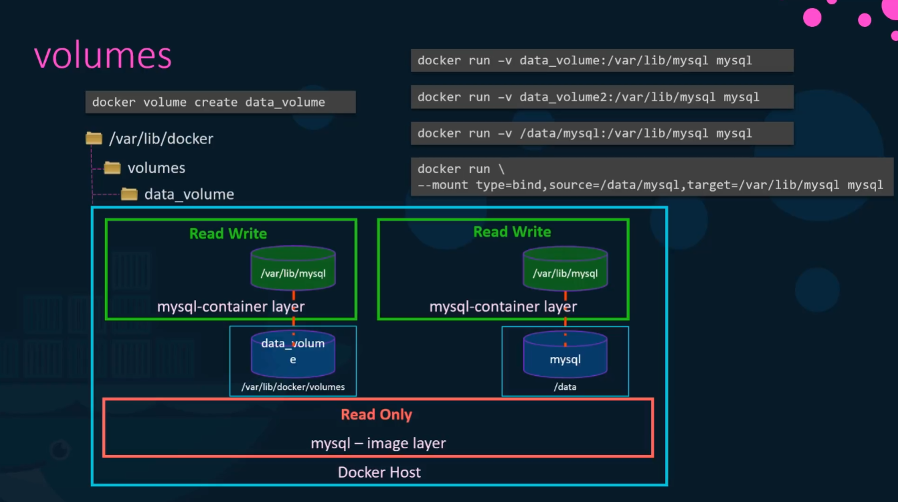
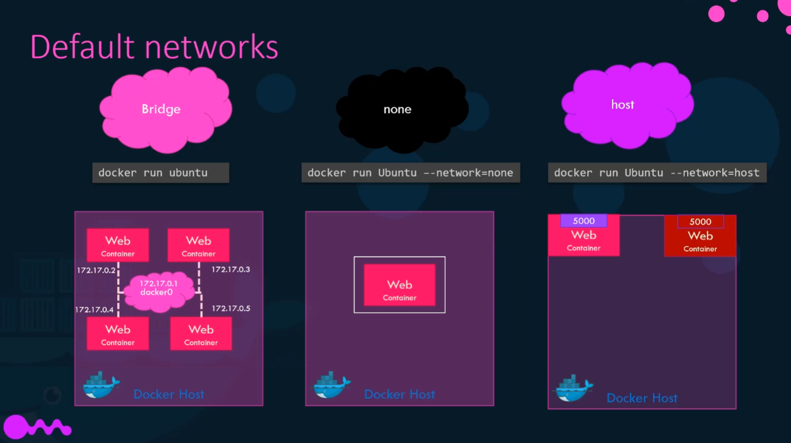
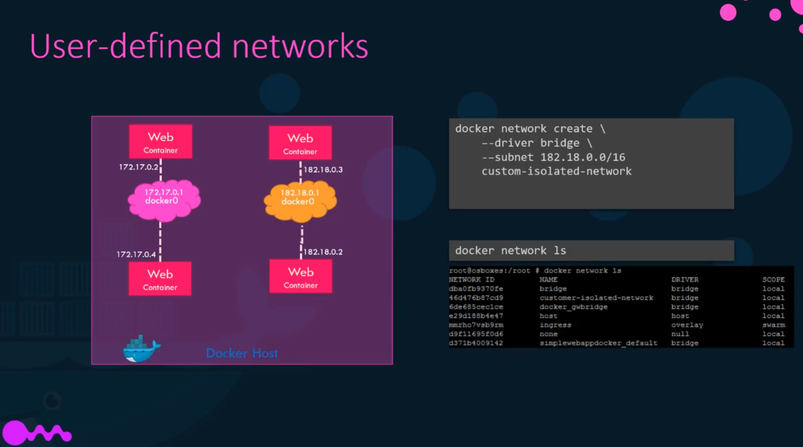
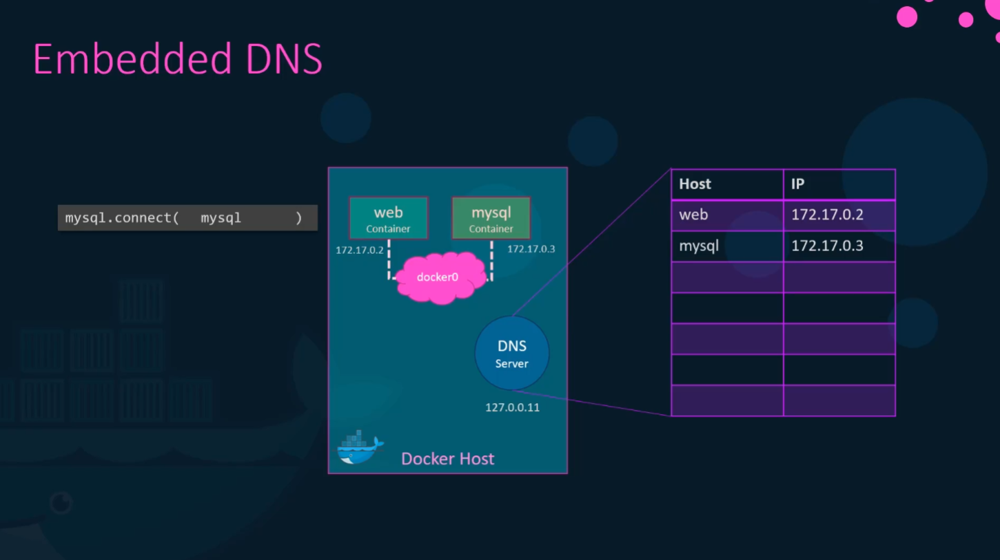

# kodekloud-docker

## docker-compose

docker-compose는 여러개의 container를 실행할 때 유용하다.

```bash
docker run simple-webapp
docker run mongodb
docker run redis:alpine
docker run ansible
```

다음과 같은 docker-compose.yml 파일 하나로 여러개의 container를 동시에 실행할 수 있다.

```yaml
# docker-compose.yml

web:
    image: "simple-webapp"
database:
    image: "mongodb"
messaging:
    image: "redis:alpine"
orchestration:
    image: "ansible"
```

만약 투표앱을 만드는 상황을 가정해보자.



- voting-app : python
- in-memory DB : redis
- worker : .NET
- db : PostgreSQL
- result-app : Node.js

```bash
docker run -d --name=redis redis
docker run -d --name=db
docker run -d --name=vote -p 5000:80 voting-app
docker run -d --nameresult -p 5001:80 result-app
docker run -d --name=worker worker
```

그러나 위와 같이 container를 실행했을 때, 제대로 동작하지 않는다. 그 이유는 컨테이너 간의 통신은 연결되어 있지 않기 때문이다. 이 문제는 `--link` flag를 이용하여 각 컨테이너를 연결해줄 수 있다.

```bash
docker run -d --name=redis redis
docker run -d --name=db postgres:9.4
docker run -d --name=vote -p 5000:80 --link redis:redis voting-app
docker run -d --nameresult -p 5001:80 --link db:db result-app
docker run -d --name=worker --link db:db --link redis:redis worker
```

이렇게 하면 다음과 같이 컨테이너가 연결되게 된다.



그러나 해당 앱을 실행할 때 마다 위의 명령어를 입력하는 것은 매우 번거롭고 비효율적인 작업이다. 따라서 해당 작업을 자동화 한다면 더 효율적인 업무가 가능할 것이다. 바로 이럴 때 `docker-compose` 를 사용하는 것이다.

위의 container들을 `docker-compose`로 다시 작성해보면 다음과 같다.

```yaml
# docker-compose.yml

redis:
    image: redis
    
db:
    image: postgres:9.4

vote:
    image: voting-app
    ports:
      - 5000:80
    links:
      - redis

result:
    image: result-app
    ports:
      - 5001:80
    links:
      - db

worker:
    image: worker
    links:
      - redis
      - db
```

각 service를 정의하고, 해당 속성에 맞는 요소들을 작성해주기만 하면 된다.

해당 앱을 실행할 때는 `docker-compose up` 명령어를 이용한다.

만약 DockerHub의 이미지가 아닌 local의 Docker 이미지를 사용하고 싶다면 `image:` 대신 `build: ./DockerfileDirectory`를 사용한다.

```yaml
# docker-compose.yml

redis:
    image: redis
    
db:
    image: postgres:9.4

vote:
    build: ./vote
    ports:
        - 5000:80
    links:
        - redis

result:
    build: ./result
    ports:
        - 5001:80
    links:
        - db

worker:
    build: ./worker
    links:
        - redis
        - db
```

### docker-compose version에 대하여

위에서 작성한 내용은 docker-compose version 1의 문법이다.

docker-compose version 2의 문법은 `docker-compose.yml`파일의  최상단에 version을 명시해주고, 기존의 항목들이 `services`의 하위 블록으로 들어오게 된다. 또한 같은 `services` 내에 있는 service라면 `link` 옵션을 지정하지 않아도 하나의 네트워크로 묶이게 된다.

`depends_on` 옵션을 사용하여 dependency를 지정할 수 있다.

```yaml
# docker-compose.yml
version: "2"
services:
    redis:
        image: redis
        
    db:
        image: postgres:9.4

    vote:
        build: ./vote
        ports:
            - 5000:80
        depends_on:
            - redis

    result:
        build: ./result
        ports:
            - 5001:80

    worker:
        build: ./worker
```

[version 3](https://docs.docker.com/compose/compose-file/compose-file-v3/)에서는 더 많은 것들이 바뀌었으니 참고

## Docker Storage



도커는 이미지를 빌드할 때 layer 쌓는 구조로 이미지를 빌드한다. 이전에 이미 빌드한 적이 있는 layer라면 캐시에 저장해두었다가 다른 이미지를 빌드할 때 해당 레이어를 사용함으로써 시간과 저장공간을 효율적으로 사용할 수 있다.

### volumes

Docker는 따로 볼륨을 지정하지 않으면 컨테이너가 종료되면서 데이터도 함께 사라진다. 따라서 영구적인 데이터 관리를 위해서는 볼륨을 따로 설정해야 한다.

`docker volume create [volume_name]` 명령어로 볼륨을 생성할 수 있다. 해당 볼륨은 `/var/lib/docker/volumes` 의 하위 폴더에 생성된다.

생성된 볼륨은 `docker run -v [volume_name]:[mount_dir]`과 같이 `-v` flag를 이용하여 해당 컨테이너에 마운트할 수 있다. 이렇게 생성된 볼륨을 마운트하면 컨테이너가 종료되어도 여전히 유지된다.

`-v` flag는 Docker 볼륨 이외에 local directory에도 마운트를 할 수 있다. `volume_name` 대신에 마운트할 local directory 위치를 입력하면 된다. 이렇게 마운트 하는 방법을 바인드 마운트라고 한다.


### network

Docker는 기본적으로 `Bridge, none, host` 세 개의 network를 설치한다.



- Bridge : 172.17 로 시작하는 Docker Host를 통해 컨테이너와 통신하는 모드
- none : 어떤 외부 접근이나 내부 컨테이너 간 통신도 허용하지 않는 모드
- host : Docker Host를 Network로 사용하는 모드. 중복된 포트의 컨테이너를 만들 수 없다.

기본적으로 Docker의 bridge network는 하나만 있다. `docker network` 명령어를 이용하여 여러 개의 network를 생성할 수 있다.



Docker 내부에서 컨테이너 사이에 통신이 필요할 때, 내장된 DNS 서버를 이용하여 컨테이너의 이름을 이용하여 통신할 수 있다.



```bash
# Docker network create example

docker network create \
--driver bridge \
--subnet 182.18.0.1/24 \
--gateway 182.18.0.1 \
wp-mysql-network
```
